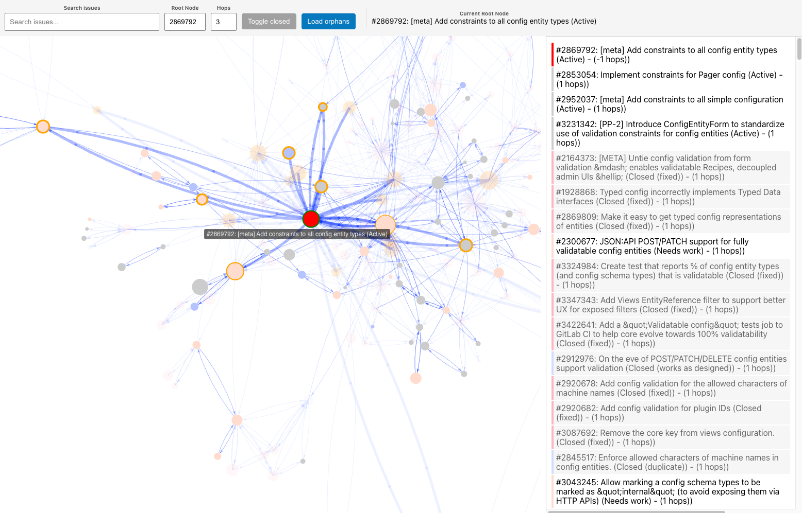

The Drupal Issue Explorer is a tool that allows visualization and exploration of Drupal.org issues and their relationships using a graph database.

# Getting started

Getting started is quite easy using ddev.

1. Clone the project
2. Run `ddev start` in the project root
3. Run `ddev neo4j-import` to ge the latest data
4. Run `ddev launch` to open the project in your browser

This will launch the project with a prepopulated Neo4j database and launch the webserver. The data is updates once in a while white automation is set up.

1. Pull all the changes `git pull`
2. Start your project `ddev neo4j-import`
3. Run `ddev launch` to open the project in your browser
